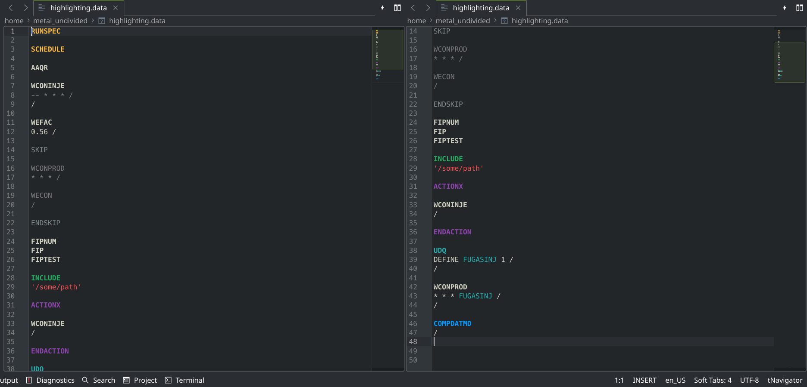

# Kate_tNav

A Kate XML file to enable tNavigator syntax highlighting.

## Features

* full support for both the classic ECLIPSE and tNavigator keyword sets
* semantics-based minimalistic highlighting style that utilizes default Kate styles
* string highlighting
* dynamic highlighting for UDQ variables and FIP family keywords

## Installation

Copy the xml file to one of the following directories per your installation type:

| Installation         | Path                                                                                    |
| -------------------- | --------------------------------------------------------------------------------------- |
| For local user       | $HOME/.local/share/org.kde.syntax-highlighting/syntax/                                  |
| For all users        | /usr/share/org.kde.syntax-highlighting/syntax/                                          |
| For Flatpak packages | $HOME/.var/app/*flatpak-package-name*/data/org.kde.syntax-highlighting/syntax/          |
| For Snap packages    | $HOME/snap/*snap-package-name*/current/.local/share/org.kde.syntax-highlighting/syntax/ |
| On Windows           | %USERPROFILE%\AppData\Local\org.kde.syntax-highlighting\syntax                          |

Installation scripts are also available in the *installation_scripts* directory.

For further information on installation and xml file specifics, please refer to the [original documentation](https://docs.kde.org/stable5/en/kate/katepart/highlight.html).
